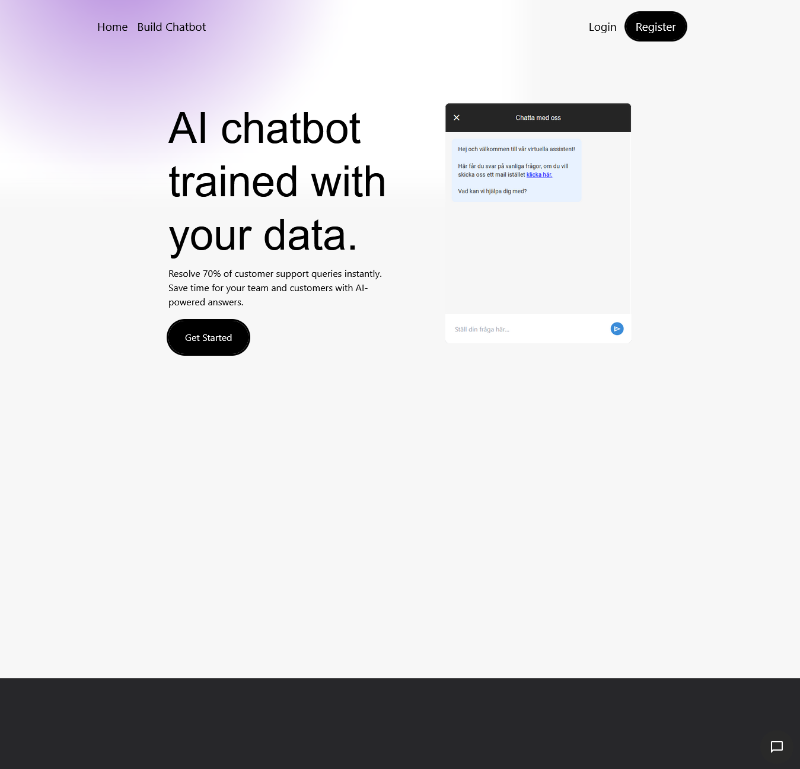
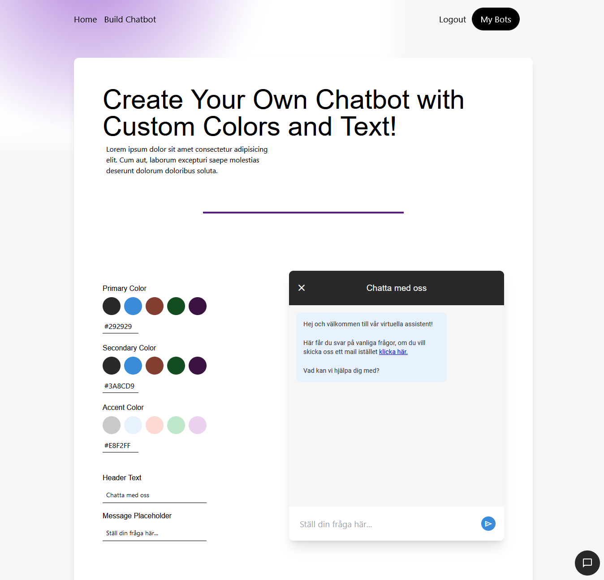
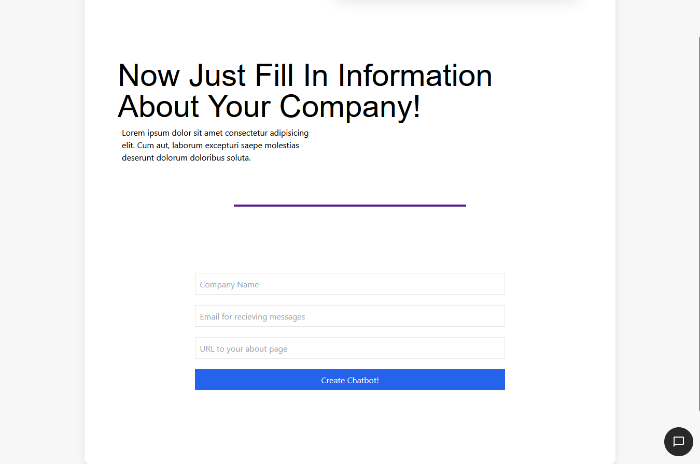
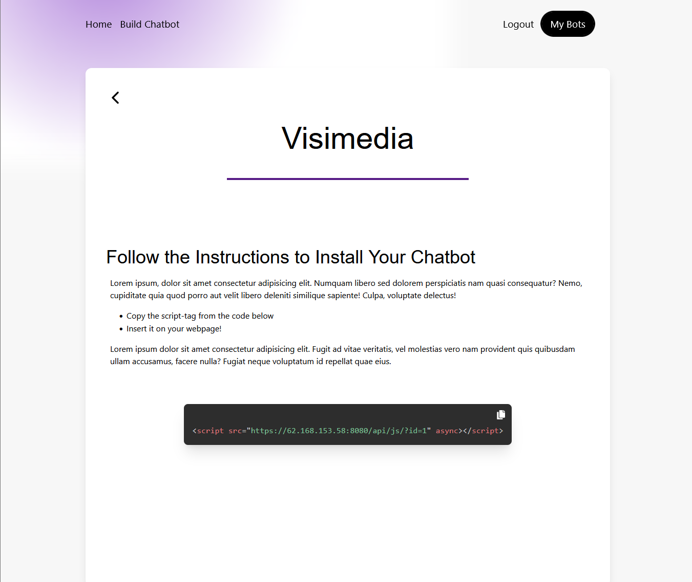
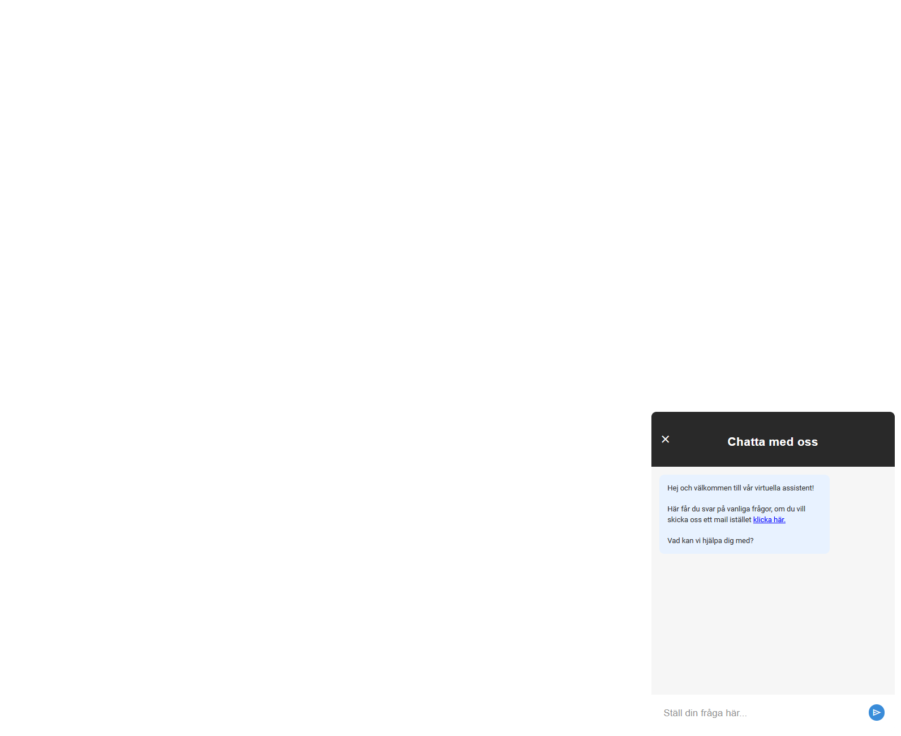
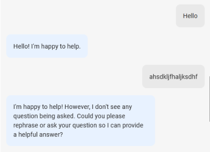
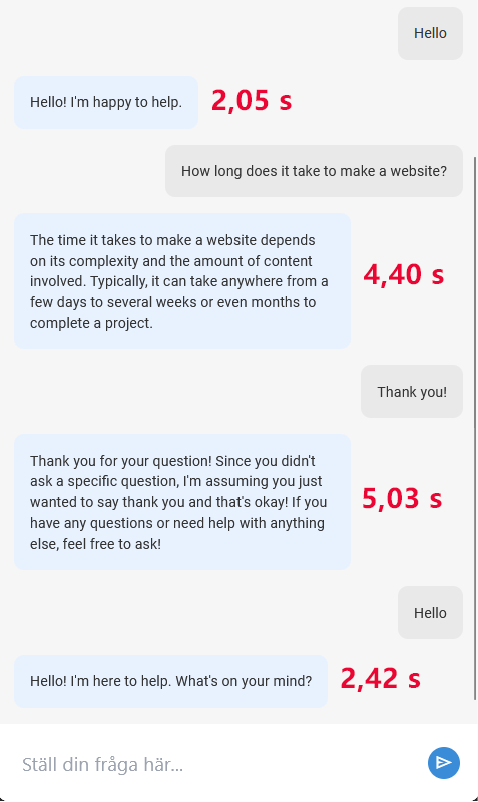

# Chatbot Examensarbete

Detta projekt utgör mitt examensarbete som sträckte sig över 6 veckor och motsvarade 30
YH-poäng.

Sammanfattningsvis har utvecklingen av chatboten varit framgångsrik och levererat en
fungerande lösning för att förbättra användarinteraktionen på webbplatser. Genom att
integrera enkelhet, prestanda och felhantering har chatboten möjliggjort snabb och tillgänglig
support för användare.
Den mest lämpliga AI-modellen visade sig vara LLama 3, som valdes
för dess prestanda och kostnadseffektivitet. Beslutet att använda en lokal AI-modell istället
för OpenAI’s API var på grund av kostnadsskäl.
För att AI-modellen skulle kunna ge personliga och korrekta svar om företagen implementerades en lösning där användare klistrar in URLen till sin FAQ/Om-sida och sedan låter AI-modellen använda den informationen.
Data om företagen och chatbotens inställningar lagrades i en SQL-databas, vilket
underlättade strukturerad datalagring.

- Backend är Node.js + Express för att hantera API-rutter och HTTP/HTTPS-förfrågningar.

- Använder en SQL-databas för lagring utav anpassningar och inställningar gjorda för chatbotsen.

- JWT (JSON Web Token) för autentisering av användarkonton.

- Lokal AI-modell (Llama 3 av Meta AI)

- Byggverktyget för chatbotsen är utvecklat i React.js + TailwindCSS.

# Resultat

## Implementationen

Chatboten skapas upp enkelt med chatbot-byggaren där man ser ändringarna i realtid.
Chatboten integreras enkelt genom att klistra in en script-tag på vilken site som helst och då laddas chatbotens kod
in automatiskt från backend-servern. Detta sätt att implementera chatbotten är jag väldigt nöjd med.

## Prestanda

Trots att AI-modellen körs lokalt och inte använder ett API för svarsgenereringen så är
prestandan ändå godkänd. När en användare skriver en fråga till chatboten utförs en fetch-
förfrågan till backenden för att hämta svaret. Denna förfrågningstid har mätts med FireFox
DevTools för att utvärdera svarstiderna. Korta svar tar vanligtvis cirka 2 sekunder att hämta,
medan längre svar kan ta uppemot 5 sekunder. I genomsnitt tog det 3,475 sekunder att få ett
svar.

## Felhantering

Vid hantering av otydliga frågor ser chatboten till att be om en omformulering av frågan.
Detta säkerställer att användarna får relevanta svar och minskar risken för missförstånd.

## Användarupplevelse

Användarupplevelsen är utformad för att vara smidig, snabb och enkel, för att användare ska
kunna effektivt interagera med chatboten och få den hjälp de behöver på ett snabbt och
tillförlitligt sätt.
Användare kan skapa och anpassa sin egen chatbot med hjälp av chatbot-byggaren, där alla
ändringar syns i realtid. Detta ger kunderna möjlighet att skräddarsy chattboten efter sina
behov och önskemål.
Kunder kan enkelt integrera chatboten på en webbplats genom att kopiera script-taggen och
sedan klistra in en den på deras webbplats. Detta ger en snabb och smidig implementering av
chattboten på olika plattformar.

# Bilder

    <h2>Startsida - Byggverktyget</h2>
    
    <h2>Utseende anpassning - Byggverktyget</h2>
    
    <h2>Data anpassning - Byggverktyget</h2>
    
    <h2>Scripttag som används för implementering - Byggverktyget</h2>
    
    <h2>Chatbot som ligger live på en tom Webflow sida - Chatbot</h2>
    
    <h2>Hantering utav otydligt prompt - Chatbot</h2>
    
    <h2>Responstider - Chatbot</h2>
    

